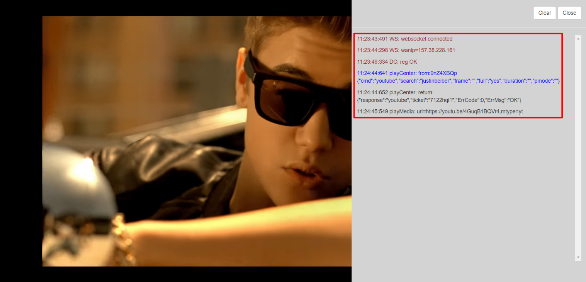

# /jj

Play a _video_ on the _SmartScreen_ using _jujue_ ****streaming service

Provide the _keyword for jujue_ to play a video upon

The _video_ is played out on the _SmartScreen_

  
The **console** _pane_ on the right of the screen displays the _actions_ taken and the corresponding _status_ _codes & messages_

_P.S.: While you can see every single detail of the action initiated by you on the console, every successful push to SmartScreen is acknowledged with a playCenter-generated return 'ticket'_

