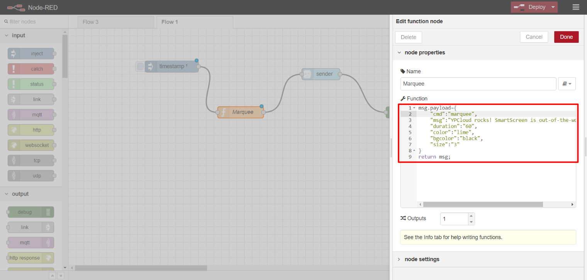
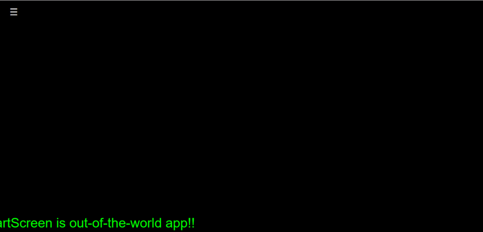

# /marquee

Push a horizontally **scrolling text ticker** for a _user-defined period_ at the bottom of the _main_ display area of the _SmartScreen_

Text in _lime_ color of size _3_ seen __**scrolling** at the bottom of the _SmartScreen_ for _60secs_

