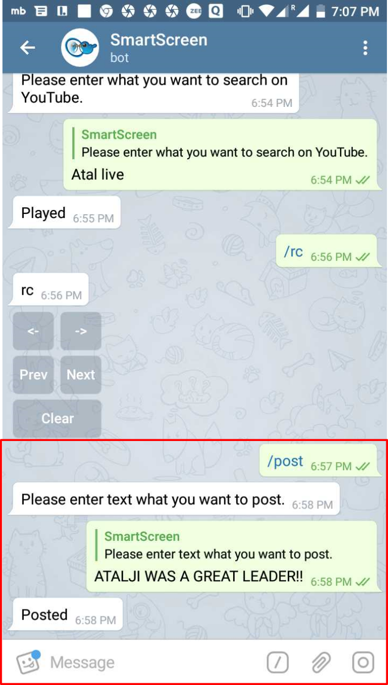
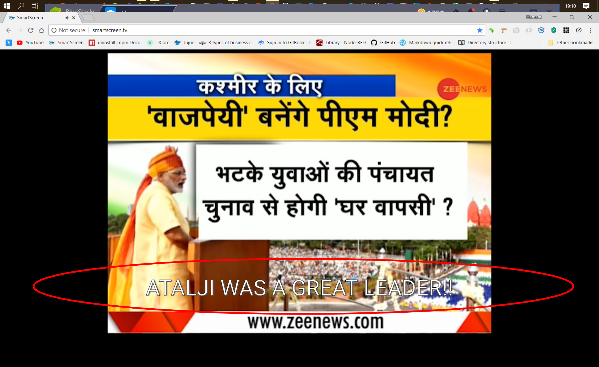

# /post

Push **Text/ Notification** on _Telegram_ to be displayed on _top_ of other _elements_ being played out on _SmartScreen_

The **Text/ Notification** being displayed on top of a _video_ being played on _SmartScreen_

