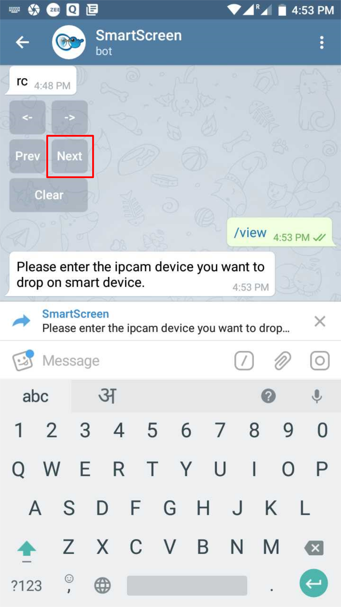
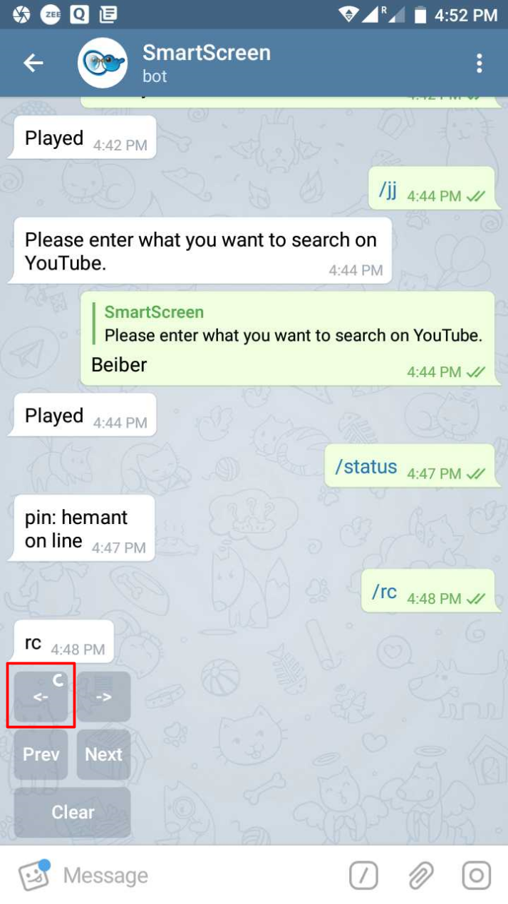
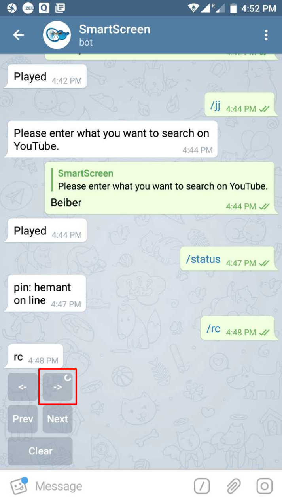

# /rc

Play out a number of _videos_ \(say\) one after the other and **control** these as a **'slideshow'** on the _Smart Screen_ using the **on-screen remote\_control** \__\*\*_\_on Telegram

Go to the _Previous_ Video, Image or a Track

Go to the _Next_ Video, Image or a Track

Go to the _First_ Video, Image or a Track

Go to the _Last_ Video, Image or a Track

_Clear_ the Video, Image or Track being played

