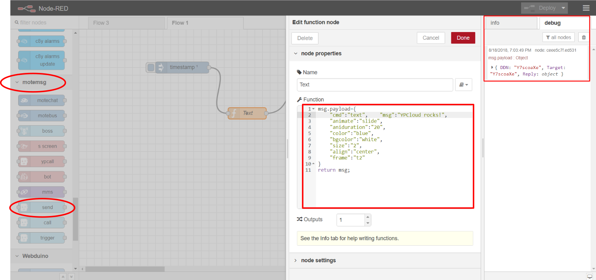
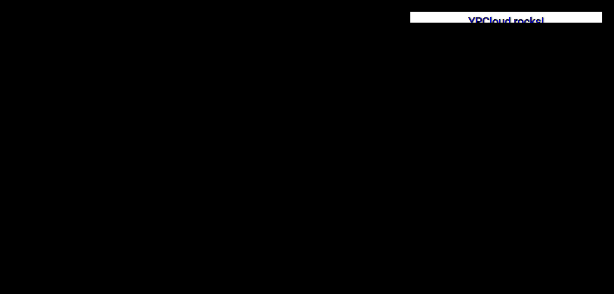
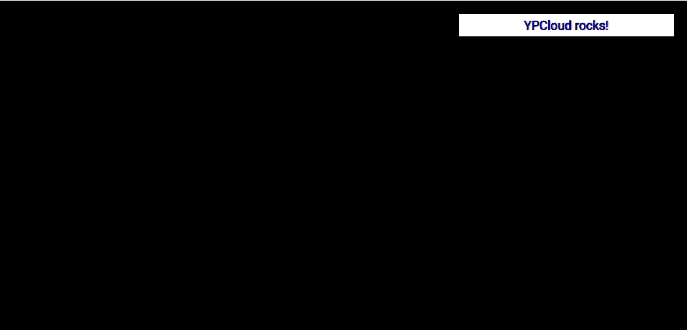

# /text

Push _center-aligned_ **animated text** of _blue_ color over _white_ background of size _2_ on to _frame\#2 \(t2\)_ of the _SmartScreen_

_Animated text_ seen displayed on the _2nd frame_ of the _SmartScreen_

