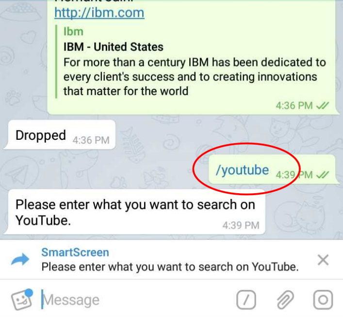
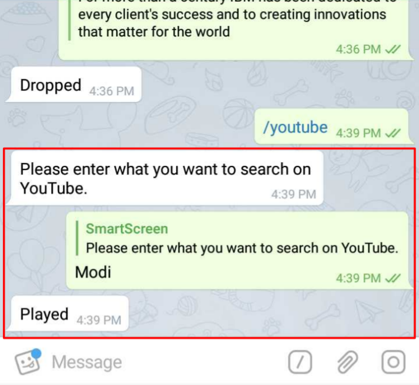

# /youtube

Push a **video** to be played on _SmartScreen_

Provide the _keyword_ for the _video_ to be played upon

  
Corresponding _video_ is played out on the _SmartScreen_

The console pane can be opened by selecting the same on the main menu available on the left of the screen.

**Console** _pane_  opens to the right of the _SmartScreen_ that displays, as you can see, the system messages starting from the SmartScreen _target\_device registration_  as well as the _return codes & messages_ against the _actions taken \(also displayed\)  by you_

