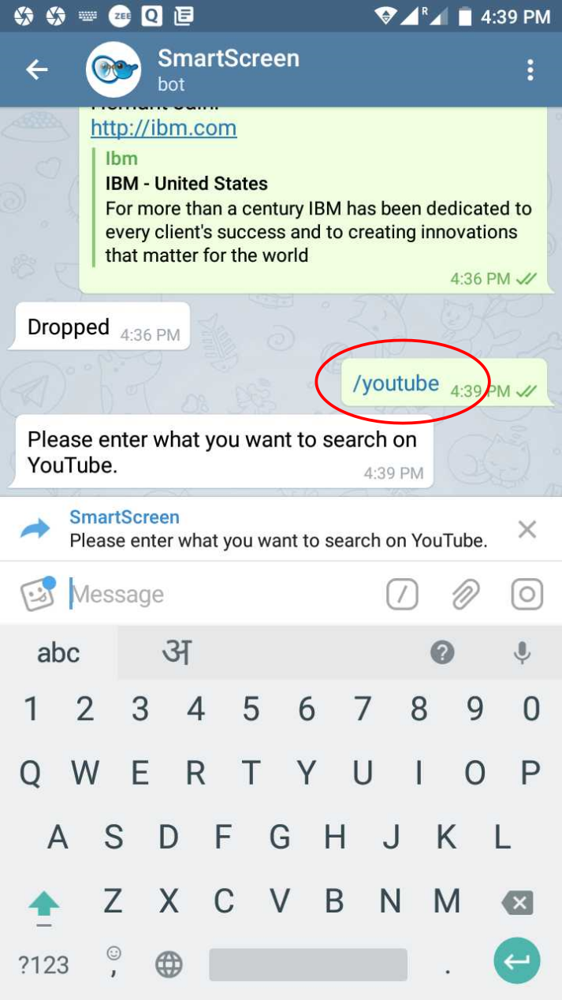
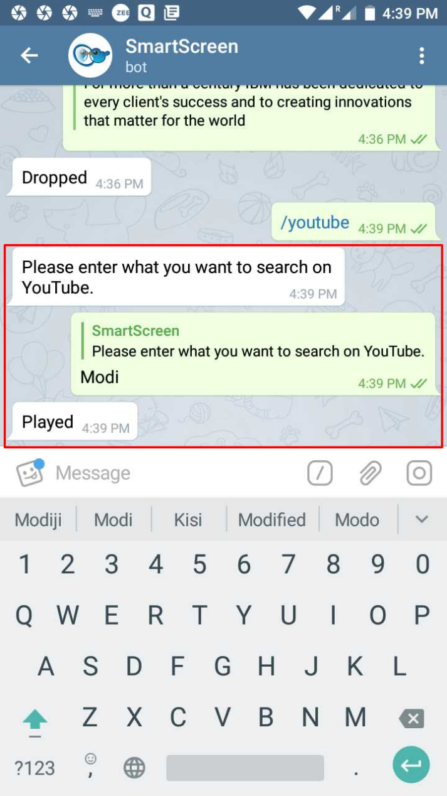
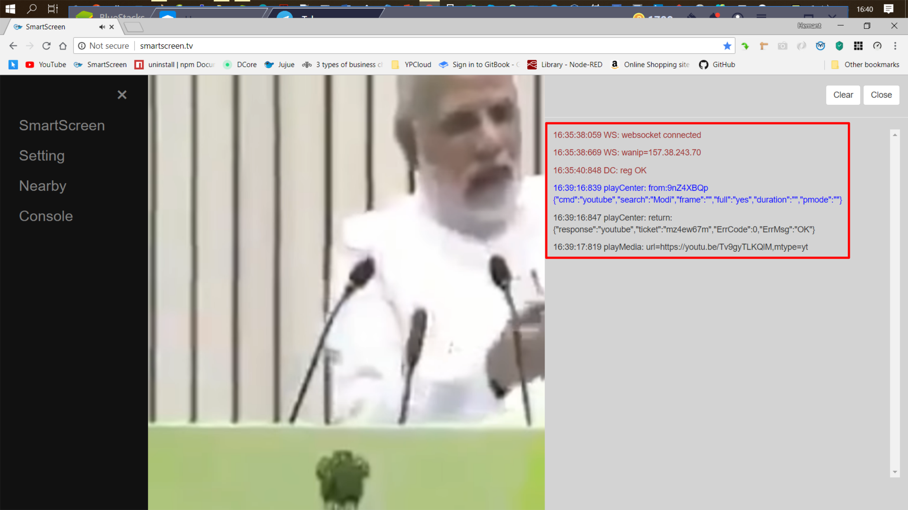

# /youtube

Play a **video** on _youtube_ service

  
Provide the **keyword** for searching the _video_ on _youtube_

  
_Corresponding video_ is played out on the _SmartScreen_

On the right is the **console** _pane_  \(when enabled\) that displays the _return messages_ and _codes_ during _SmartScreen registration_ as well as against the _actions taken_ at the _TG_ end

