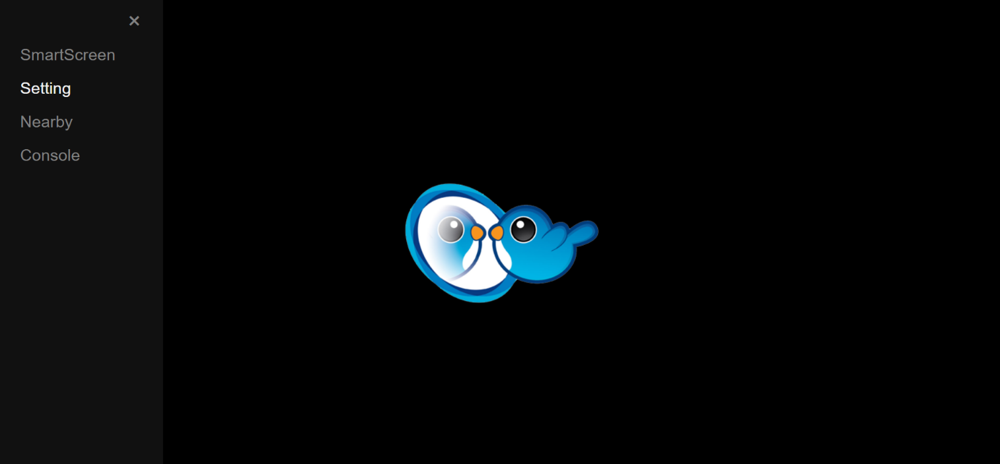
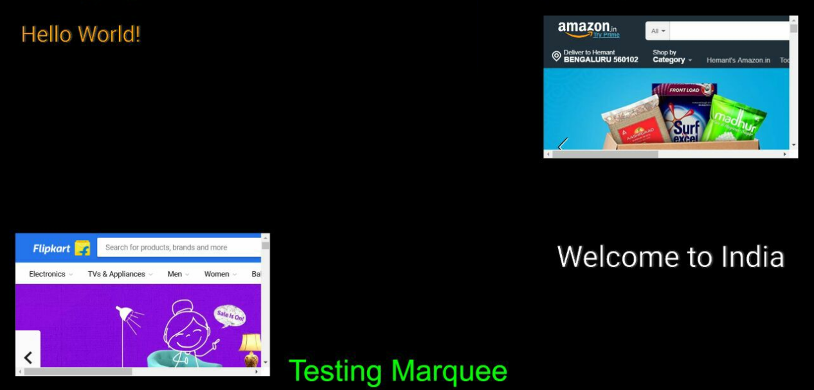

# SmartScreen At A Glance

**SmartScreen** is an **'EI'** Cloud App meant for

* Displaying _**content**_ pushed through **various** _modes_ **-** _Flows, Chats, Voice Inputs, App Triggers..._   

     **Content** that can be pushed

  * **URL**: e-Commerce, Wikis, Videos, Images, Audios
  * **Slideshows**: _Auto-scrolling_ slideshow of _Videos, Images, Presentations_...with _user-defined duration per member element_
  * **RC**: A touch-screen _Remote Control_ for you to _navigate_ through the above-stated slideshow\(s\)
  * **Text**: Animated, Scrolling \(& a whole lot of user-defined attributes\) 
  * **Flash**: Text Notification
  * **Action Status**: Animated _Info, Warning, Error, Fatal_ or _Success_ blocks with _custom message_ within  

* **Custom content** pushed _automatically_ based on _deep learning_ at **different times** of the day, say, targeting a 'hugely' varied customer profile, walking into a _Mall/ Hyper Market/ Mega Store/ Super Store_ at different times of the day, including, say, their _facial expressions_ when exposed to different merchandise displayed on the _screens/ billboards/ banners_ in the store 
* **SmartScreen** provides for _division_ of the screen _display area_ into **4 frames**  of _equal sizes_, besides the _entire screen_ as a 5th option, implying that _different content_ can be pushed to the _different frames_ or/and something has to be played out on the entire screen - i.e. to say, one has the options of _t1, t2, t3, t4 & main_ display areas to target! 

