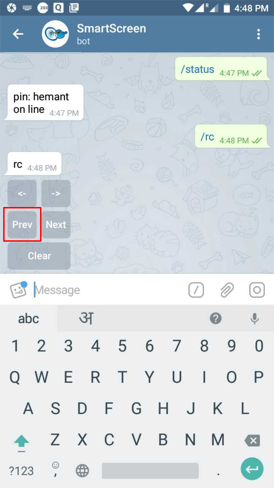
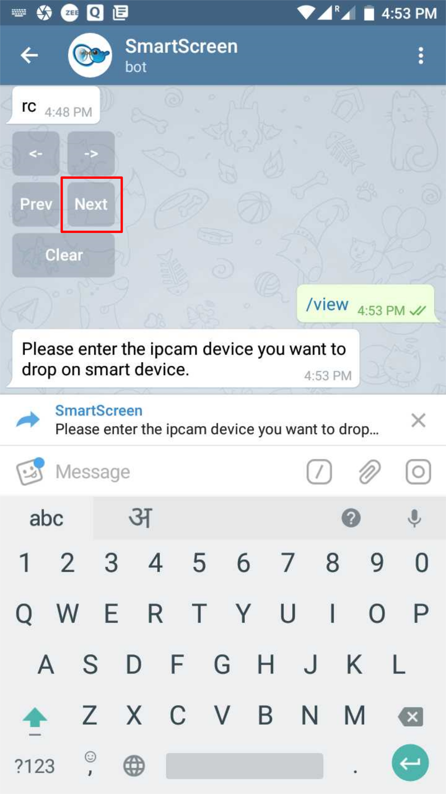
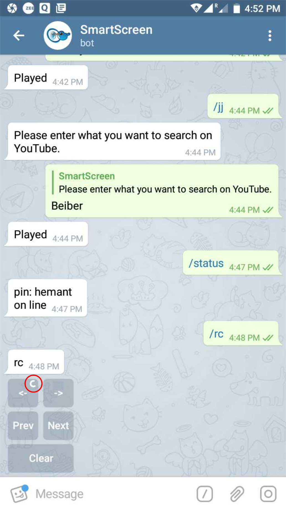
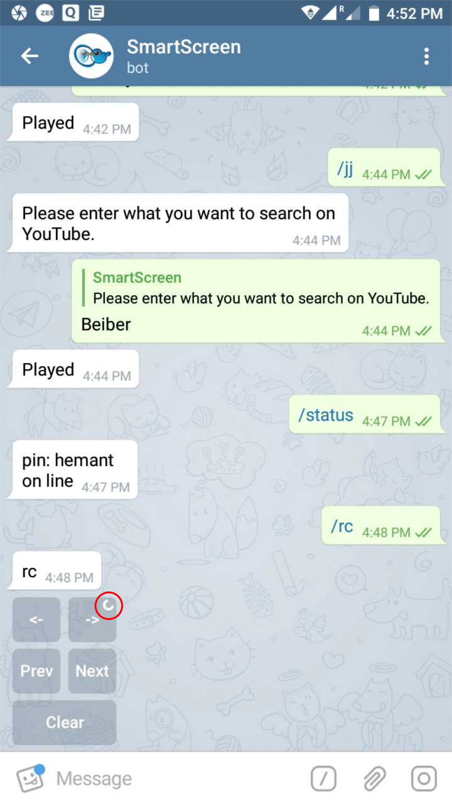
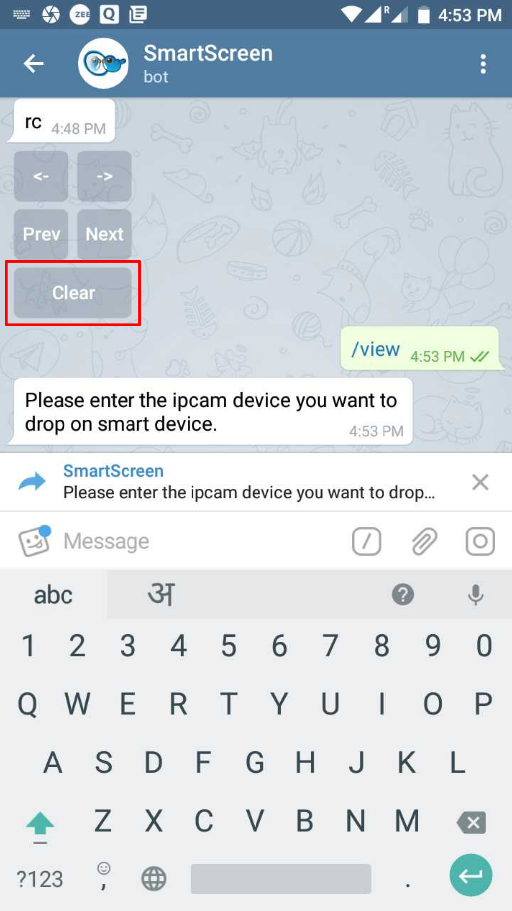

# /rc

### _Control_ a _slideshow_ on the _Smart Screen_ using the _on-screen remote control_ on Telegram

#### _Previous_ Video, Image or a Track

#### _Next_ Video, Image or a Track

#### _First_ Video, Image or a Track

#### _Last_ Video, Image or a Track

#### _Clear_ the Video, Image or Track being played

