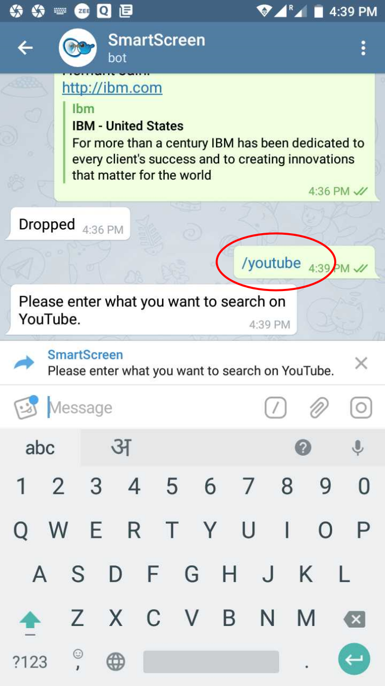
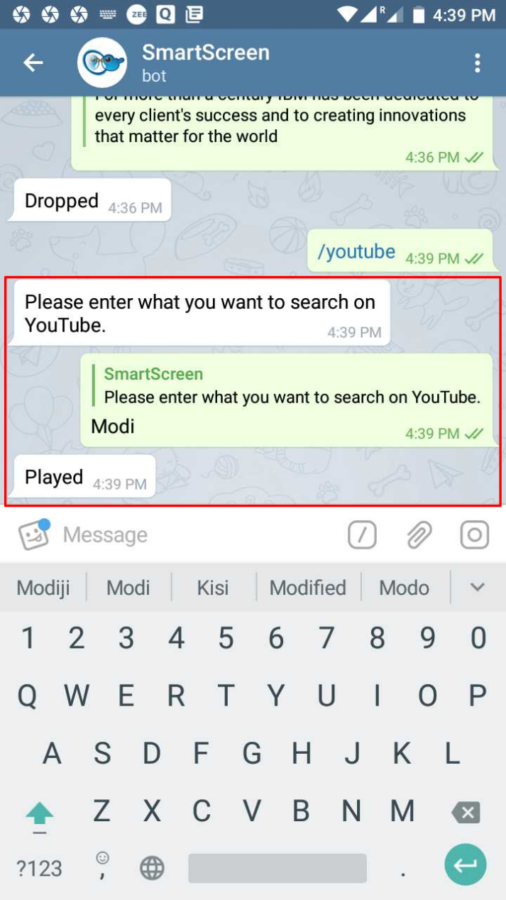
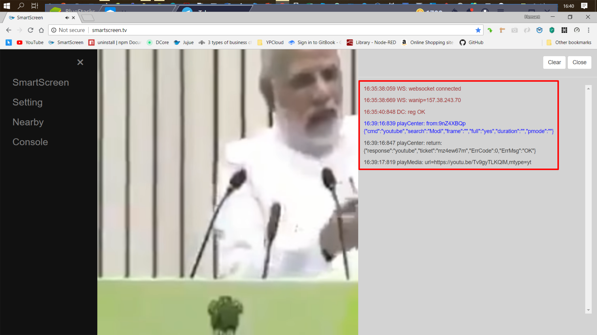

# /youtube

## Play a _video_ on _youtube_

## Provided the _keyword_ that gets _pushed_ to _youtube_ on the target _SmartScreen_

## Corresponding _video_ played vide _youtube_ on the target _SmartScreen_

